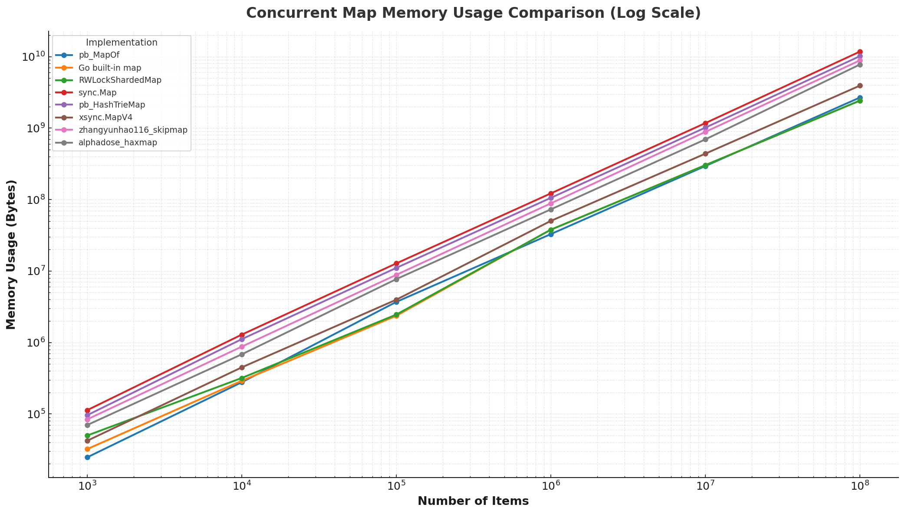
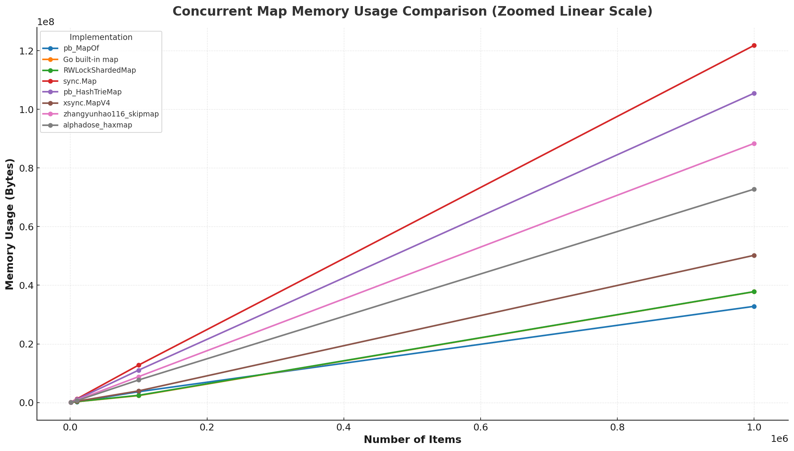

<!--
[](https://github.com/llxisdsh/pb/actions)
[](https://pkg.go.dev/github.com/llxisdsh/pb)
[](https://goreportcard.com/report/github.com/llxisdsh/pb)
[](https://codecov.io/gh/llxisdsh/pb)
-->

# pb.MapOf

MapOf is a high-performance concurrent map implementation that offers significant
performance improvements over sync.Map in many common scenarios.

Benchmarks show that MapOf can achieve several times better read performance
compared to sync.Map in read-heavy workloads, while also providing competitive
write performance. The actual performance gain varies depending on workload
characteristics, key types, and concurrency patterns.

Quick Benchmark Comparison:

| Implementation  | Load (ns/op) | Store (ns/op) | Throughput (M ops/s) |
|-----------------|-------------:|--------------:|---------------------:|
| **pb.MapOf** 🏆 |     **0.20** |      **0.59** |            **92.44** |
| sync.Map        |         3.66 |         24.27 |                21.84 |


## 🎯 Use Cases

pb.MapOf excels in scenarios requiring:

- **High-frequency caching** with read-heavy workloads
- **Real-time data processing** with concurrent access patterns
- **Microservices** requiring low-latency key-value operations
- **Gaming backends** with high-concurrency player state management
- **Financial systems** needing atomic operations on shared data
- **IoT applications** with massive concurrent sensor data updates


## 🔧 Key Features

- Uses cache-line aligned structures to prevent false sharing
- Automatic CPU Cache Line Size Adaptation.  
  The library automatically adapts to the CPU's cache line size.
  You can also manually specify it using compile-time options like `mapof_opt_cachelinesize_64, 128, 256` etc.
- Enhanced the lock mechanism to ensure consistent performance under highly contended concurrent access
- Counter Performance Optimization.  
  For improved counter performance, use `mapof_opt_enablepadding` to force padding around counters, reducing false sharing.
- Compatibility
  - Already optimized for strong memory models (e.g., x86 TSO, Apple Silicon).
  - Already optimized for Weak memory models.
  - Tested/Validated CPUs with default configurations:
    AMD Ryzen Threadripper 3970X, ARM Neoverse-N2, Apple M3 Ultra, Qualcomm Snapdragon 636 (32bit)
  - Enable `mapof_opt_atomiclevel_1` or `mapof_opt_atomiclevel_2` for better performance on strong memory models.
- Implements zero-value usability for convenient initialization
- Provides lazy initialization for better performance
- Defaults to Go's built-in hash function, customizable on creation or initialization.  
  For high hash computation costs, use `mapof_opt_embeddedhash` to enable hash caching (disabled by default as Go's built-in hashing is generally efficient)
- Offers complete sync.Map API compatibility
- Specially optimized for read operations
- Supports parallel resizing for better scalability
- Includes rich functional extensions such as LoadOrStoreFn, ProcessEntry, Size, IsZero,
  Clone, and batch processing functions
- Thoroughly tested with comprehensive test coverage
- Delivers exceptional performance (see benchmark results below)

## 📊 Comprehensive Benchmarks

Benchmark results (1,000,000 records) show `pb.MapOf` consistently outperforms other implementations, 
achieving the fastest operations for Store (0.5893 ns/op), LoadOrStore (0.4760 ns/op), Load (0.1987 ns/op) 
and Mixed (0.4467 ns/op)

```
goos: windows
goarch: amd64
pkg: github.com/llxisdsh/pb
cpu: AMD Ryzen Threadripper 3970X 32-Core Processor 
```


<details>
<summary> Benchmark Test (06/19/2025) </summary>

```go
const countStore = 1_000_000
const countLoadOrStore = countStore
const countLoad = min(1_000_000, countStore)

func mixRand(i int) int {
	return i & (8 - 1)
}

func BenchmarkStore_original_syncMap(b *testing.B) {
	b.ReportAllocs()
	var m sync.Map
	runtime.GC()
	b.ResetTimer()
	b.RunParallel(func(pb *testing.PB) {
		i := 0
		for pb.Next() {
			m.Store(i, i)
			i++
			if i >= countStore {
				i = 0
			}
		}
	})
}

func BenchmarkLoadOrStore_original_syncMap(b *testing.B) {
	b.ReportAllocs()
	var m sync.Map
	runtime.GC()
	b.ResetTimer()
	b.RunParallel(func(pb *testing.PB) {
		i := 0
		for pb.Next() {
			_, _ = m.LoadOrStore(i, i)
			i++
			if i >= countLoadOrStore {
				i = 0
			}
		}
	})
}

func BenchmarkLoad_original_syncMap(b *testing.B) {

	b.ReportAllocs()
	var m sync.Map
	for i := 0; i < countLoad; i++ {
		m.Store(i, i)
	}
	runtime.GC()
	b.ResetTimer()
	b.RunParallel(func(pb *testing.PB) {
		i := 0
		for pb.Next() {
			_, _ = m.Load(i)
			i++
			if i >= countLoad {
				i = 0
			}
		}
	})
}

func BenchmarkMixed_original_syncMap(b *testing.B) {
	b.ReportAllocs()
	var m sync.Map
	for i := 0; i < countLoad; i++ {
		m.Store(i, i)
	}
	runtime.GC()

	b.ResetTimer()
	b.RunParallel(func(pb *testing.PB) {
		i := 0
		for pb.Next() {
			r := mixRand(i)
			if r == 0 {
				m.Store(i, i)
			} else if r == 1 {
				m.Delete(i)
			} else if r == 2 {
				_, _ = m.LoadOrStore(i, i)
			} else {
				_, _ = m.Load(i)
			}
			i++
			if i >= countLoad<<1 {
				i = 0
			}
		}
	})
}

```
</details>

| Implementation                 | Operation   |       Ops/sec |   ns/op | B/op | Allocs/op |
|--------------------------------|-------------|--------------:|--------:|-----:|----------:|
| `original_syncMap`             | Store       |    47,236,741 |   24.27 |   64 |         3 |
|                                | LoadOrStore |    56,023,192 |   19.03 |   17 |         2 |
|                                | Load        |   404,771,172 |    3.66 |    0 |         0 |
|                                | Mixed       |   142,293,642 |    8.60 |   10 |         0 |
| `pb_MapOf` 🏆                  | Store       | 1,000,000,000 |    0.59 |    0 |         0 |
|                                | LoadOrStore | 1,000,000,000 |    0.48 |    0 |         0 |
|                                | Load        | 1,000,000,000 |    0.20 |    0 |         0 |
|                                | Mixed       | 1,000,000,000 |    0.45 |    0 |         0 |
| `xsync_MapOf`                  | Store       |   142,851,074 |    7.60 |   16 |         1 |
|                                | LoadOrStore |   293,945,829 |    3.64 |    0 |         0 |
|                                | Load        |   729,350,713 |    1.64 |    0 |         0 |
|                                | Mixed       |   491,628,387 |    2.20 |    2 |         0 |
| `pb_HashTrieMap`               | Store       |    62,662,484 |   18.30 |   48 |         1 |
|                                | LoadOrStore |    86,982,994 |   11.95 |    1 |         0 |
|                                | Load        |   463,348,550 |    3.58 |    0 |         0 |
|                                | Mixed       |   198,404,397 |    6.16 |    6 |         0 |
| `alphadose_haxmap`             | Store       |    80,418,174 |   14.01 |    9 |         1 |
|                                | LoadOrStore |    75,698,793 |   14.39 |    9 |         1 |
|                                | Load        |   767,338,982 |    1.92 |    0 |         0 |
|                                | Mixed       |   186,024,159 |    5.52 |    2 |         0 |
| `zhangyunhao116_skipmap`       | Store       |    29,587,840 |   39.17 |    9 |         1 |
|                                | LoadOrStore |    37,524,507 |   30.38 |    1 |         0 |
|                                | Load        |   527,466,034 |    2.27 |    0 |         0 |
|                                | Mixed       |   183,319,764 |    6.22 |    1 |         0 |
| `riraccuia_ash`                | Store       |    51,692,203 |   21.81 |   62 |         4 |
|                                | LoadOrStore |    28,938,676 |   41.67 |   94 |         3 |
|                                | Load        |   269,917,735 |    4.64 |    7 |         0 |
|                                | Mixed       |   124,839,320 |    9.94 |   18 |         1 |
| `fufuok_cmap`                  | Store       |    29,590,686 |   38.21 |    1 |         0 |
|                                | LoadOrStore |    43,682,427 |   27.92 |    0 |         0 |
|                                | Load        |   151,875,836 |    7.74 |    0 |         0 |
|                                | Mixed       |    25,265,125 |   46.51 |    0 |         0 |
| `mhmtszr_concurrent_swiss_map` | Store       |    29,849,112 |   40.21 |    1 |         0 |
|                                | LoadOrStore |    27,447,705 |   45.02 |    0 |         0 |
|                                | Load        |   163,669,803 |    7.66 |    0 |         0 |
|                                | Mixed       |    30,439,160 |   36.53 |    0 |         0 |
| `orcaman_concurrent_map`       | Store       |    34,420,544 |   33.46 |    1 |         0 |
|                                | LoadOrStore |    50,175,614 |   25.41 |    1 |         0 |
|                                | Load        |   145,646,887 |    8.70 |    0 |         0 |
|                                | Mixed       |    48,974,994 |   26.18 |    0 |         0 |
| `RWLockShardedMap_256`         | Store       |    69,052,428 |   15.79 |    1 |         0 |
|                                | LoadOrStore |   119,077,255 |    9.45 |    0 |         0 |
|                                | Load        |   287,863,598 |    4.17 |    0 |         0 |
|                                | Mixed       |   172,448,331 |    6.98 |    0 |         0 |
| `RWLockMap`                    | Store       |     4,238,468 |  269.00 |    1 |         0 |
|                                | LoadOrStore |     9,066,169 |  163.10 |    1 |         0 |
|                                | Load        |    33,225,810 |   36.11 |    0 |         0 |
|                                | Mixed       |     9,591,573 |  127.70 |    0 |         0 |
| `snawoot_lfmap`                | Store       |       364,705 | 3153.00 | 7754 |        48 |
|                                | LoadOrStore |     8,887,498 |  205.60 |  518 |         2 |
|                                | Load        |   281,609,623 |    4.22 |    0 |         0 |
|                                | Mixed       |     1,899,039 |  630.00 | 2453 |        10 |


- RWLockShardedMap_256: A 256-shard concurrent map using Go's native map + RWMutex per shard (benchmark reference). 
  Sharding theoretically boosts performance/throughput for any map.


<details>
<summary> Store Throughput Test (07/15/2025) </summary>

```go

const total = 100_000_000

func testInsert_pb_MapOf(t *testing.T, total int, numCPU int, preSize bool) {
	time.Sleep(1 * time.Second)
	runtime.GC()
	
	var m *MapOf[int, int]
	if preSize {
		m = NewMapOf[int, int](WithPresize(total))
	} else {
		m = NewMapOf[int, int]()
	}

	var wg sync.WaitGroup
	wg.Add(numCPU)

	start := time.Now()

	batchSize := total / numCPU

	for i := 0; i < numCPU; i++ {
		go func(start, end int) {
			//defer wg.Done()

			for j := start; j < end; j++ {
				m.Store(j, j)
			}
			wg.Done()
		}(i*batchSize, min((i+1)*batchSize, total))
	}

	wg.Wait()

	elapsed := time.Since(start)

	size := m.Size()
	if size != total {
		t.Errorf("Expected size %d, got %d", total, size)
	}

	t.Logf("Inserted %d items in %v", total, elapsed)
	t.Logf("Average: %.2f ns/op", float64(elapsed.Nanoseconds())/float64(total))
	t.Logf("Throughput: %.2f million ops/sec", float64(total)/(elapsed.Seconds()*1000000))

	// rand check
	for i := 0; i < 1000; i++ {
		idx := i * (total / 1000)
		if val, ok := m.Load(idx); !ok || val != idx {
			t.Errorf("Expected value %d at key %d, got %d, exists: %v", idx, idx, val, ok)
		}
	}
}

func TestInsert_pb_MapOf(t *testing.T) {
	t.Run("1 no_pre_size", func(t *testing.T) {
		testInsert_pb_MapOf(t, total, 1, false)
	})

	t.Run("64 no_pre_size", func(t *testing.T) {
		testInsert_pb_MapOf(t, total, runtime.GOMAXPROCS(0), false)
	})
	t.Run("1 pre_size", func(t *testing.T) {
		testInsert_pb_MapOf(t, total, 1, true)
	})

	t.Run("64 pre_size", func(t *testing.T) {
		testInsert_pb_MapOf(t, total, runtime.GOMAXPROCS(0), true)
	})
}
```
</details>

| Implementation & Case       | Throughput<br>(M ops/s) | Performance Scale       |
|-----------------------------|------------------------:|-------------------------|
| pb_MapOf (64/pre)           |                  165.98 | ━━━━━━━━━━━━━━━━━━━━━━━ |
| xsync_MapV4 (64/pre)        |                   92.51 | ━━━━━━━━━━━━━           |
| pb_MapOf (64)               |                   92.44 | ━━━━━━━━━━━━━           |
| RWLockShardedMap_256 (64)   |                   40.77 | ━━━━━━━━                |
| pb_HashTrieMap (64)         |                   25.54 | ━━━━━                   |
| zhangyunhao116_skipmap (64) |                   25.37 | ━━━━━                   |
| pb_MapOf (1/pre)            |                   25.36 | ━━━━━                   |
| xsync_MapV4 (64)            |                   23.40 | ━━━━━                   |
| original_syncMap (64)       |                   21.84 | ━━━━                    |
| pb_MapOf (1)                |                   20.10 | ━━━━                    |
| xsync_MapV4 (1/pre)         |                    6.06 | ━                       |
| xsync_MapV4 (1)             |                    4.89 | ━                       |
| RWLockShardedMap_256 (1)    |                    3.47 | ━                       |
| zhangyunhao116_skipmap (1)  |                    3.38 | ━                       |
| alphadose_haxmap (64/pre)   |                    2.88 | ━                       |
| pb_HashTrieMap (1)          |                    1.73 | ━                       |
| alphadose_haxmap (1/pre)    |                    1.00 | ━                       |
| original_syncMap (1)        |                    1.42 | ━                       |
| alphadose_haxmap (1)        |                    0.92 | ━                       |
| alphadose_haxmap (64)       |                    0.57 | ━                       |

- (1): 1 goroutine without pre-allocation
- (1/pre): 1 goroutine with pre-allocation
- (64): 64 goroutines without pre-allocation
- (64/pre): 64 goroutines with pre-allocation

<details>
<summary> Memory Usage Test (08/04/2025) </summary>

```go
func Test_MemoryPeakReduction(t *testing.T) {
	if testing.Short() {
		t.Skip("Skipping memory test in short mode")
	}
	
	const numItems = 100000
	
	var m1, m2 runtime.MemStats
	runtime.GC()
	runtime.ReadMemStats(&m1)
	
	m := NewMapOf[int, int]()
	
	for i := 0; i < numItems; i++ {
		m.Store(i, i)
	}
	runtime.GC()
	runtime.ReadMemStats(&m2)
	
	peak := m2.Alloc - m1.Alloc
	t.Logf("pb_MapOf memory usage: %d bytes, items: %d", peak, m.Size())
}
```
</details>

Benchmark results indicate that pb.MapOf matches the native Go map in memory efficiency, and even outperforms it in most scenarios.



## 🚀 Quick Start

### Installation

```bash
go get github.com/llxisdsh/pb@latest
```


### Prerequisites

The `pb.Map` implementation uses `golang.org/x/sys` to determine the system's `CacheLineSize`.
For optimal performance, ensure your build environment has the latest version of this dependency:
```
go get golang.org/x/sys@latest
```

### Usage

```go
package main

import (
	"encoding/json"
	"fmt"
	"github.com/llxisdsh/pb"
)

func main() {
	// === Initialization ===
	// Zero-value initialization - ready to use with lazy initialization
	var cache pb.MapOf[string, int]

	// After zero initialization, InitWithOptions can be used to configure initialization (optional).
	// MapOf does not support multiple initializations.
	// NewMapOf neither requires nor allows the use of InitWithOptions.
	cache.InitWithOptions(pb.WithPresize(100), pb.WithShrinkEnabled())

	// Pre-sized initialization - optimal for known capacity scenarios
	cache2 := pb.NewMapOf[string, int](pb.WithPresize(1000000))

	// Shrink-enabled initialization - suitable for fluctuating data volumes
	cache3 := pb.NewMapOf[string, int](pb.WithShrinkEnabled())

	// Fast String Hasher - optimized for short string/[]byte keys
	// Provides 2-3x write throughput improvement for keys ≤12 bytes
	// Approaches native Go map performance for short strings
	// Ideal for identifiers, tags, short descriptive text
	fastStringCache := pb.NewMapOf[string, int](pb.WithFastStringHasher())
	fastByteCache := pb.NewMapOf[[]byte, int](pb.WithFastStringHasher())

	// Custom Hash Function initialization - default is Go's built-in hash function
	type UserID struct {
		UserID   int64
		TenantID int64
	}
	userCache := pb.NewMapOf[UserID, string](pb.WithKeyHasher(func(key UserID, seed uintptr) uintptr {
		return uintptr(key.UserID)
	}))

	// Custom Value Equals Function initialization - default is Go's built-in value comparison
	comparableCache := pb.NewMapOf[string, int](pb.WithValueEqual(func(a, b int) bool { 
		return a == b 
	}))

	// Using multiple initialization configurations
	cache4 := pb.NewMapOf[string, int](pb.WithPresize(1000000), pb.WithShrinkEnabled())
	
	// === Basic Read/Write Operations ===
	// Store: Insert or update a key-value pair
	cache.Store("user:123", 42)

	// Load: Retrieve value with existence check
	value, exists := cache.Load("user:123")
	fmt.Printf("Value: %d, Exists: %t\n", value, exists)

	// Delete: Remove a key-value pair
	cache.Delete("user:123")

	// === Atomic Operations ===
	// LoadOrStore: Atomic read-or-insert operation
	actual, loaded := cache.LoadOrStore("user:456", 100)
	fmt.Printf("Actual: %d, Was loaded: %t\n", actual, loaded)

	// LoadOrStoreFn: Lazy value generation - function called only if key doesn't exist
	// Perfect for expensive computations
	result := cache.LoadOrStoreFn("computed:key", func() int {
		fmt.Println("Computing expensive value...")
		return 43
	})
	fmt.Printf("Result: %d\n", result)

	// LoadAndDelete: Atomic read-and-delete operation
	deletedValue, wasPresent := cache.LoadAndDelete("user:456")
	fmt.Printf("Deleted value: %d, Was present: %t\n", deletedValue, wasPresent)

	// LoadAndUpdate: Atomic update operation
	previousValue, wasUpdated := cache.LoadAndUpdate("counter", 1)
	fmt.Printf("Previous: %d, Updated: %t\n", previousValue, wasUpdated)

	// === Compare-and-Swap Operations (requires comparable values) ===
	comparableCache.Store("counter", 10)

	// CompareAndSwap: Compare and swap if values match
	swapped := comparableCache.CompareAndSwap("counter", 10, 20)
	fmt.Printf("Swapped: %t\n", swapped)

	// CompareAndDelete: Compare and delete if values match
	deleted := comparableCache.CompareAndDelete("counter", 20)
	fmt.Printf("Deleted: %t\n", deleted)

	// Swap: Exchange value and return old one
	oldVal, loaded := comparableCache.Swap("new_key", 30)
	fmt.Printf("Old value: %d, Was loaded: %t\n", oldVal, loaded)

	// === Advanced Operations ===
	// ProcessEntry: Atomic conditional processing with complex business logic
	cache.ProcessEntry("user:789", func(entry *pb.EntryOf[string, int]) (*pb.EntryOf[string, int], int, bool) {
		if entry != nil {
			// Update existing entry
			newEntry := &pb.EntryOf[string, int]{Value: entry.Value + 1}
			return newEntry, entry.Value, true
		}
		// Create new entry
		return &pb.EntryOf[string, int]{Value: 1}, 0, false
	})

	// LoadEntry: Get entry pointer for high-performance scenarios
	// Warning: Never modify the Key or Value in the returned Entry
	entry := cache.LoadEntry("user:789")
	if entry != nil {
		fmt.Printf("Entry: %s -> %d\n", entry.Key, entry.Value)
	}

	// === Iteration Operations ===
	// Range: Iterate over all key-value pairs
	cache.Range(func(key string, value int) bool {
		fmt.Printf("%s: %d\n", key, value)
		return true // Return false to stop iteration early
	})

	// RangeEntry: Iterate over all entry pointers (more efficient)
	cache.RangeEntry(func(entry *pb.EntryOf[string, int]) bool {
		fmt.Printf("%s: %d\n", entry.Key, entry.Value)
		return true
	})

	// All: Go 1.23+ iterator support
	for key, value := range cache.All() {
		fmt.Printf("%s: %d\n", key, value)
	}

	// === Batch Operations ===
	// RangeProcessEntry: Batch process all entries
	cache.RangeProcessEntry(func(loaded *pb.EntryOf[string, int]) *pb.EntryOf[string, int] {
		if loaded != nil && loaded.Value < 100 {
			// Double all values less than 100
			return &pb.EntryOf[string, int]{Value: loaded.Value * 2}
		}
		return loaded // Keep unchanged
	})

	// BatchProcess: Batch process iterator data
	data := map[string]int{"a": 1, "b": 2, "c": 3}
	cache.BatchProcess(maps.All(data), func(_ string, v int, loaded *pb.EntryOf[string, int]) (*pb.EntryOf[string, int], int, bool) {
		return &pb.EntryOf[string, int]{Value: v * 10}, v, true
	})

	// === Capacity Management ===
	// Size: Get current number of elements
	size := cache.Size()
	fmt.Printf("Current size: %d\n", size)

	// IsZero: Check if map is empty
	isEmpty := cache.IsZero()
	fmt.Printf("Is empty: %t\n", isEmpty)

	// Grow: Pre-allocate capacity to avoid frequent resizing
	cache.Grow(10000)

	// Shrink: Manually shrink to release excess memory
	cache.Shrink()

	// Clear: Remove all data and reset to initial capacity
	cache.Clear()

	// === Data Conversion ===
	// Repopulate with some data for demonstration
	cache.Store("key1", 100)
	cache.Store("key2", 200)

	// Clone: Deep copy the entire map
	clonedCache := cache.Clone()
	fmt.Printf("Cloned size: %d\n", clonedCache.Size())

	// ToMap: Convert to regular Go map
	regularMap := cache.ToMap()
	fmt.Printf("Regular map size: %d\n", len(regularMap))

	// FromMap: Batch import from regular Go map
	sourceMap := map[string]int{"import1": 1, "import2": 2}
	cache.FromMap(sourceMap)

	// === Output And Statistics ===
	// JSON Marshal
	jsonData, _ := json.Marshal(&cache)
	fmt.Printf("Final cache json output: %s\n", jsonData)

	// JSON Unmarshal
	cache.Clear()
	_ = json.Unmarshal(jsonData, &cache)

	// String output
	fmt.Printf("Final cache output: %v\n", &cache)

	// Stats: Get detailed performance statistics
	stats := cache.Stats()
	fmt.Printf("Stats: Buckets=%d, Growths=%d, Shrinks=%d\n",
		stats.RootBuckets, stats.TotalGrowths, stats.TotalShrinks)
}
```


### Compile-Time Optimizations

Optimize performance for specific use cases with build tags. Warning: Incorrect optimization choices may degrade performance. Choose carefully based on your actual scenario.

```bash
# === Cache Line Size Optimization ===
# Optimize based on target CPU's cache line size
# Auto-detection is default, but manual specification may be needed for cross-compilation
go build -tags mapof_opt_cachelinesize_32   # For some embedded systems
go build -tags mapof_opt_cachelinesize_64   # For most modern CPUs
go build -tags mapof_opt_cachelinesize_128  # For some high-end server CPUs
go build -tags mapof_opt_cachelinesize_256  # For some specialized architectures

# === Memory Model Optimization ===
# For strong memory model CPU architectures (x86, Apple Silicon)
# ⚠️ Warning: May cause data races on weak memory model architectures
go build -tags mapof_opt_atomiclevel_1      # Reduce some atomic operations
go build -tags mapof_opt_atomiclevel_2      # Further reduce atomics (more aggressive)

# === Counter Performance Optimization ===
# Add padding around counters to reduce false sharing in high-concurrency scenarios
# Note: Increases memory usage - suitable for memory-abundant, high-concurrency environments
go build -tags mapof_opt_enablepadding

# === Hash Caching Optimization ===
# Cache hash values in entries, suitable for expensive hash computation scenarios
# Note: Go's built-in hashing is usually fast; this may increase memory overhead without performance gain
go build -tags mapof_opt_embeddedhash

# === Combined Optimization Examples ===

# Build with optimizations for FUJITSU A64FX's CMG-based ccNUMA architecture:
go build -tags "mapof_opt_cachelinesize_256 mapof_opt_enablepadding"

# Complex key types configuration:
go build -tags "mapof_opt_embeddedhash"
```

Optimization Selection Guide:

- Default Configuration : Suitable for most scenarios, no additional tags needed
- NUMA architecture: Consider mapof_opt_enablepadding
- Complex Key Types : If hash computation is expensive, consider mapof_opt_embeddedhash
- Cross-Compilation : May need manual mapof_opt_cachelinesize_* specification
  Performance Testing Recommendation: Before production use, benchmark different optimization combinations against your specific workload to determine the best configuration.

## 📚 Documentation

- Complete API documentation is available at [pkg.go.dev/github.com/llxisdsh/pb](https://pkg.go.dev/github.com/llxisdsh/pb)

- See [mapof flow](mapof_flow.md) for implementation details.


## 🙏 Acknowledgments

pb.MapOf builds upon the excellent work of [xsync](https://github.com/puzpuzpuz/xsync) (specifically the v3 version, which is licensed under MIT). We extend our gratitude to the xsync authors and the broader Go community.
Reproduce its introduction below:

```
MapOf is like a Go map[K]V but is safe for concurrent
use by multiple goroutines without additional locking or
coordination. It follows the interface of sync.Map with
a number of valuable extensions like Compute or Size.

A MapOf must not be copied after first use.

MapOf uses a modified version of Cache-Line Hash Table (CLHT)
data structure: https://github.com/LPD-EPFL/CLHT

CLHT is built around idea to organize the hash table in
cache-line-sized buckets, so that on all modern CPUs update
operations complete with at most one cache-line transfer.
Also, Get operations involve no write to memory, as well as no
mutexes or any other sort of locks. Due to this design, in all
considered scenarios MapOf outperforms sync.Map.

MapOf also borrows ideas from Java's j.u.c.ConcurrentHashMap
(immutable K/V pair structs instead of atomic snapshots)
and C++'s absl::flat_hash_map (meta memory and SWAR-based lookups).
```

---

# pb.HashTrieMap


**pb.HashTrieMap** is a highly optimized implementation of Go's built-in `HashTrieMap`, delivering **50%+ performance improvements** while maintaining full compatibility.

## 🎯 Key Improvements

- **Lazy Value Generation**: `LoadOrStoreFn` support for expensive computations
- **50%+ Performance Gain**: Optimized initialization and atomic operations
- **Full Compatibility**: Drop-in replacement for built-in HashTrieMap
- **Comprehensive Testing**: All original tests pass plus additional validation

## 🔧 Technical Optimizations

- **Eliminated `inited` Field**: Uses root pointer directly for state management
- **Lazy Initialization**: Defers initialization until first write operation
- **Hash Caching**: Caches hash values to accelerate expand operations

---

# 📄 License

Licensed under [MIT License](LICENSE).
