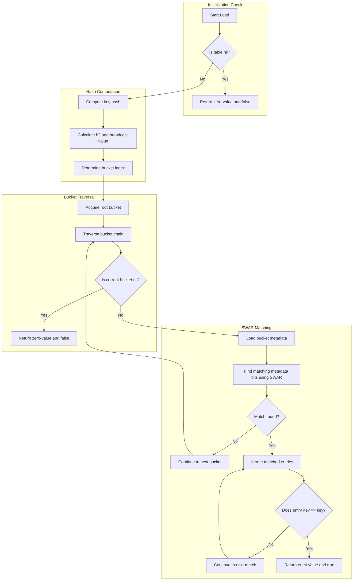
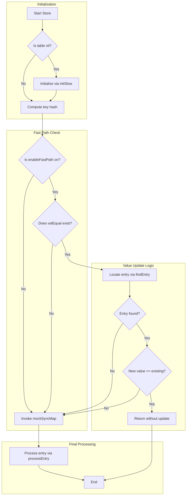
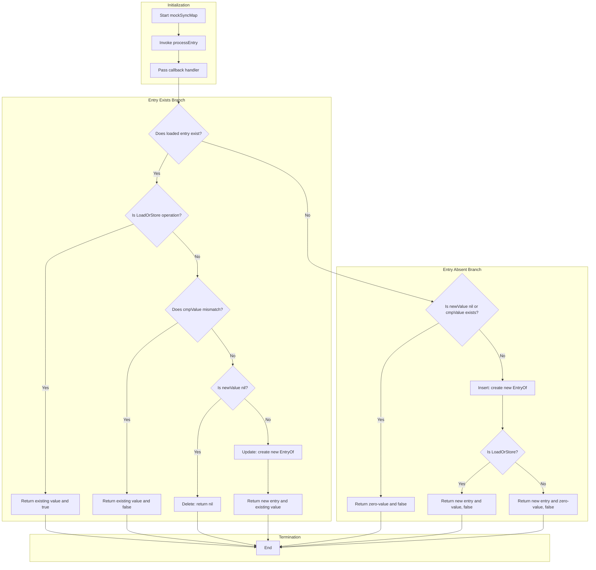
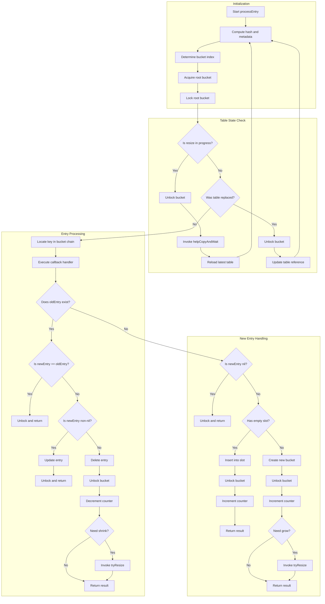
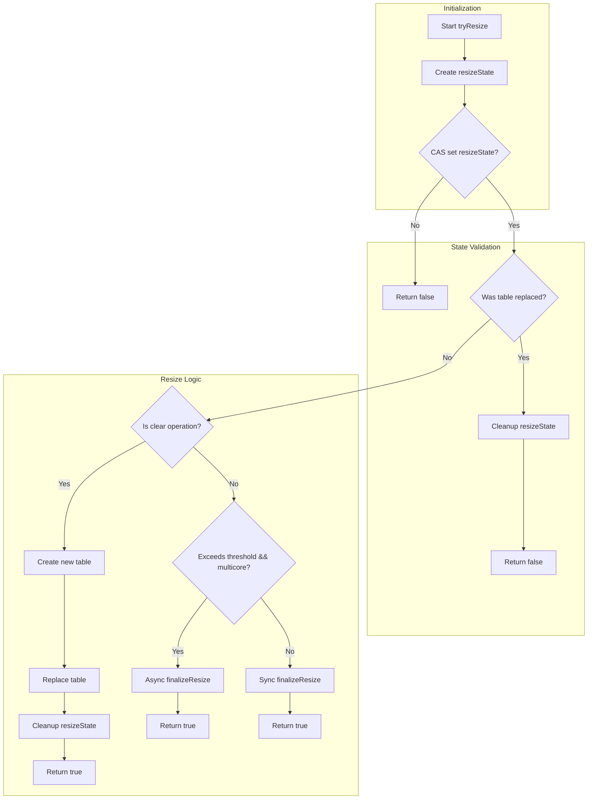
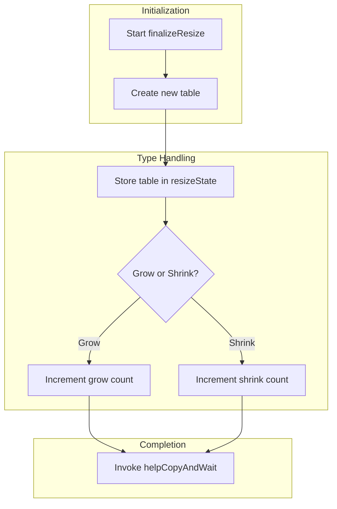
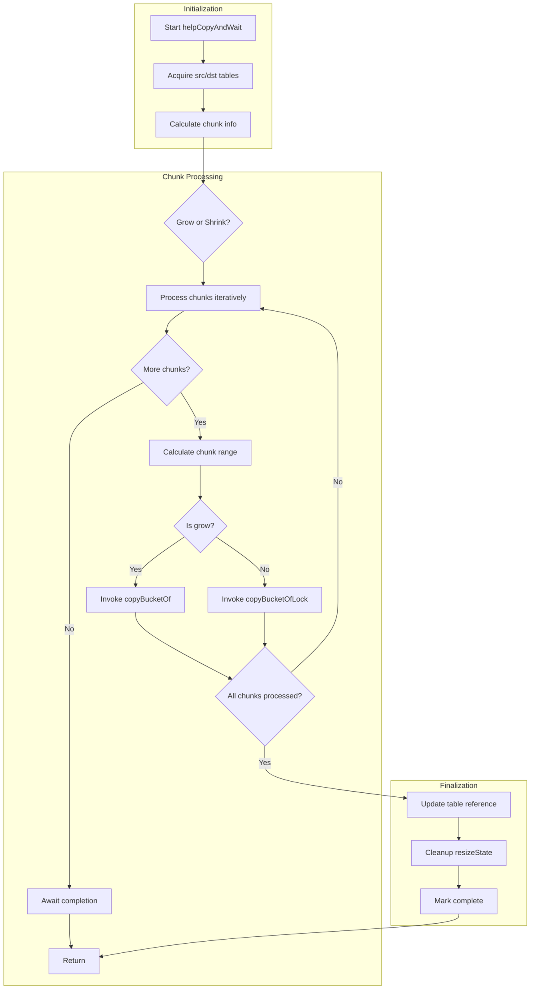
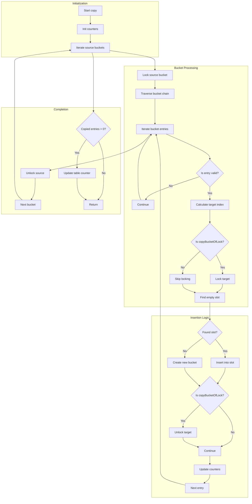

## Technical Features

- CLHT Cache Line Alignment  
  vent false sharing through padded structs (cache-line aligned), with automatic cache line size detection
- SWAR Technology  
  Accelerate metadata matching via bitwise-SIMD techniques (SWAR algorithm optimized through word-level parallelism), 
  delivering hardware-agnostic performance rivaling native SIMD instructions
- Lazy Initialization  
  Avoid unnecessary memory allocations through on-demand initialization
- Lock-Free Reads  
  Fully lock-free Load operations for maximum read performance
- Bucket-Level Locking  
  Write operations only acquire per-bucket locks, minimizing contention through fine-grained synchronization with atomic write abstraction
- Optimized Spinlocks  
  Replace default locks with high-efficiency spinlocks, reducing false sharing
- Fast-Path Filter for Writes  
  Pre-write read-only fast checks act as prefetch and branch pruning
- Parallel Progressive Resizing  
  Large tables resize via parallel multi-goroutines element copying, assisted only by user-operation goroutines
- High-Performance Hashing  
  Utilize Go's most efficient built-in hash algorithm, with special optimizations for integer keys

## Function Analysis

### Load Operation

### Store Operation

### mockSyncMap Operation

### processEntry Operation

### tryResize Operation

### finalizeResize Operation

### helpCopyAndWait Operation

### copyBucketOf / copyBucketOfLock Operation
